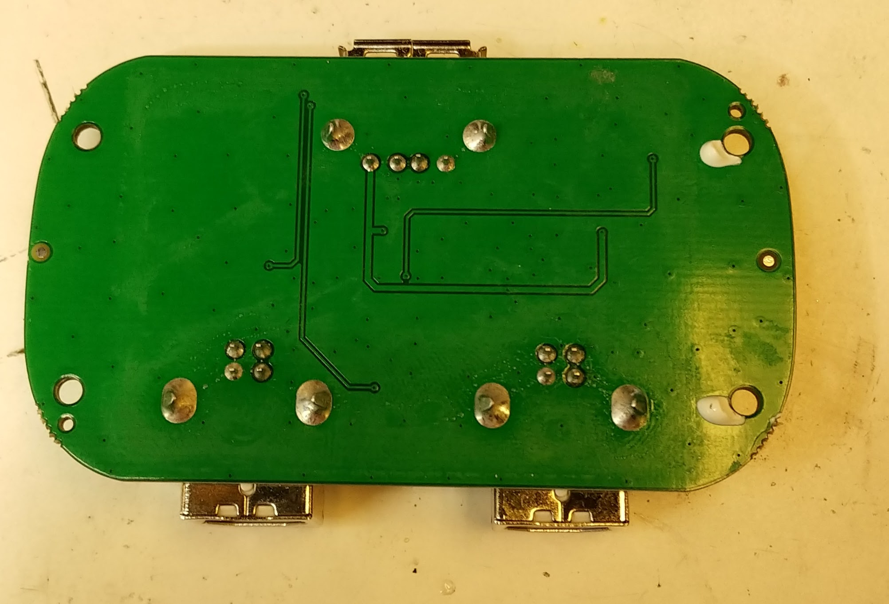
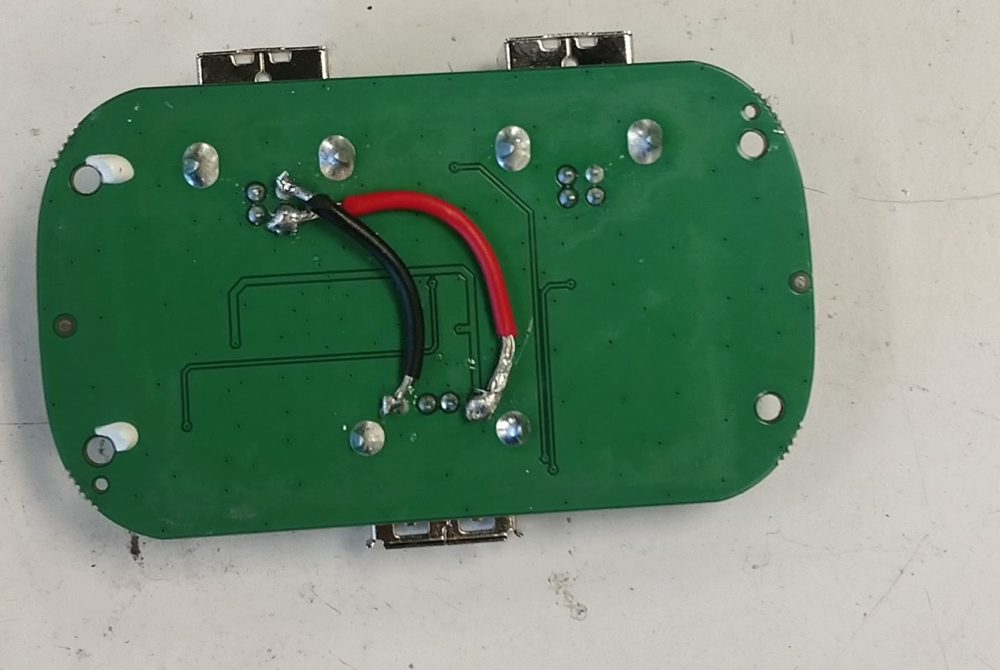
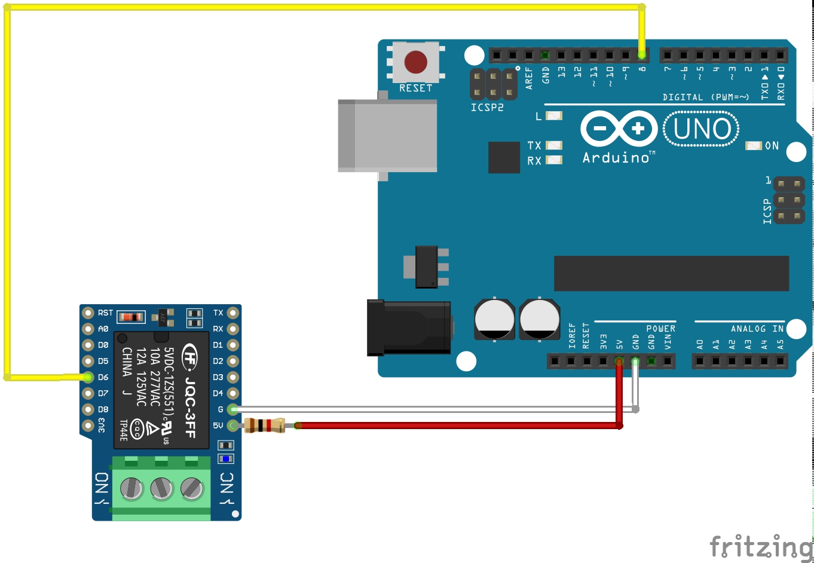
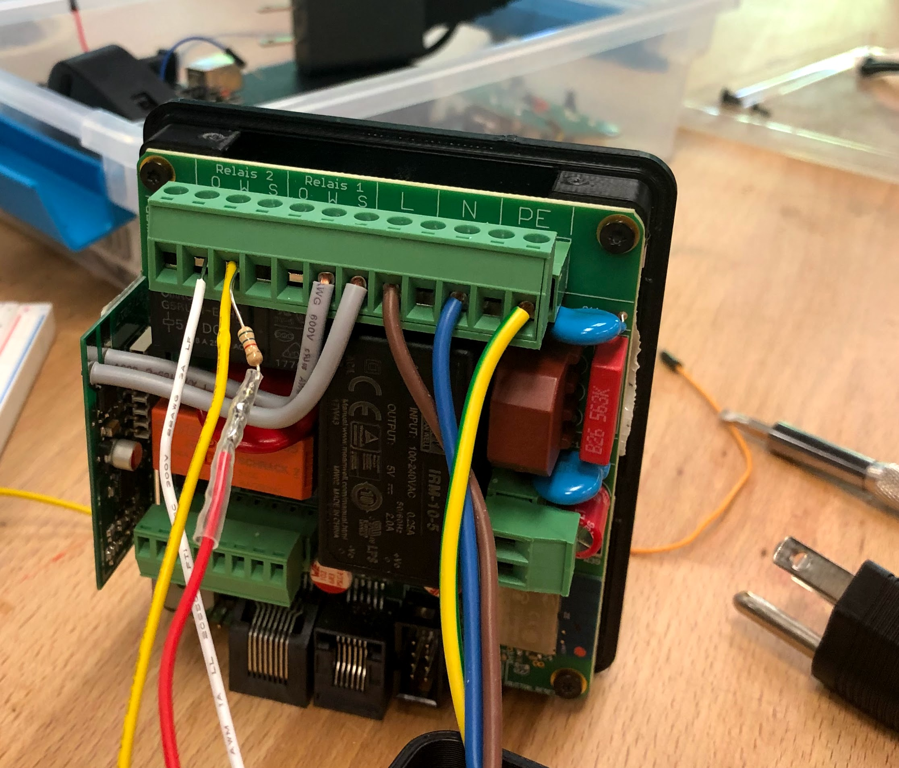
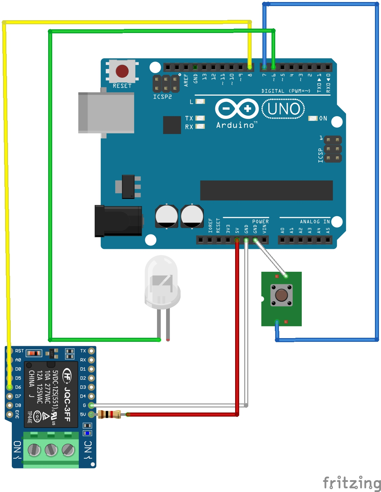

## 📝 Details

We embarked on this project to have access control and tracking over equipment at the CoMotion MakerSpace @ University of Washington. For this we use Fabman, a SaaS/Hardware as a Service which gives us authentication and authorization over equipment in the MakerSpace. Being a MakerSpace in the university, a lot of the equipment we use are hand-me-downs from industry. Though possible for the smaller machines, we didn't feel comfortable passing so many watts through the Fabman Bridge for some of our equipment (specifically our massive red Universal laser cutter), and instead wanted to use a USB solution where we could programmatically control a USB port and thus the communication between the user and the equipment.

Enter this hacked USB switch which an Arduino acts as an interface to:

Using the on-board relay of the Fabman bridge, we're able to determine whether or not access has been granted to the equipment. Our requirements are as follows:
* When access isn't granted, we ensure the USB switch is switched to a port that's disconnected from the equipment. 
* If access is granted, the USB switch is switched to the port with the equipment attached and the user is able to use the machine.

With the way we setup the hardware connections, the code to ensure the switch is on the correct port is remarkably simple and elegant:

if the relay and the led aren't the same value, we press the button, which makes them the same value. This occurs whenever the state of the relay (which is controlled by the Fabman bridge), changes.

## 🛠 Guide

By following this guide you too can hack a USB switch which will allow you to use an arduino to programmatically control it!

### Materials
* [Arduino Uno](https://amzn.to/2OqPTH5)
* [USB Switch](https://amzn.to/2Yb0qdT)
* [Fabman Bridge](http://bit.ly/2OseD1t) (we did this on v1 but v2 may also work!)
* Hot glue gun & glue
* Soldering materials ➡️ hookup wire, solder, soldering iron, etc.
* Painter's tape or sharpie for labeling

### Steps

_NOTE: please ensure that you set up your hardware the same as ours; there are some steps that won't work (such as hacking the switch to think another device is plugged in when it's not) if you don't understand which parts of the switch are connected. I got caught up on this multiple times so it's easiest just to follow our working examples here_ 😄

#### Arduino
1. Upload the code [here](src/usb_switch.ino) in the Arduino application to the Arduino Uno. You may need to select the board/port settings which you can search the net for.
2. Unplug the arduino, do the steps in [USB Switch](#usb-switch) directly below and come back to step 3.
3. This is a simplification from the USB switch, but hopefully this makes sense: plug the hookup wire from the USB Switch into the following inputs on the Arduino:
[Arduino USB Switch Diagram](media/arduino_usb_switch_diagram.jpg "Arduino USB Switch Diagram")
Ensure that you get the positive and ground connections on the button correct. I made this circuit as if you're seeing it with the USB switch in front of you, with the single USB A port facing you and the two USB B ports facing away.
1. You can test the connections by editing the _usb-switch.ino_ code. Uncomment the lines with button set to `INPUT` and the line with `Serial.println()` containing the string `"button"`. Then comment out the line with button set to `OUTPUT` and the single `if` condition. If you have issues, you may need to comment out other lines referenced. If everything works, when you open up the serial console on Arduino and begin pressing the button on the USB switch, you should see a change from 0 to 1 or 1 to 0 on the serial monitor. In addition, you'll see the LED change its value from 0 to 1 or 1 to 0 on the serial monitor.
2. If you can successfully read the button, you should be able to use the `pressButton()` function as well. You can go ahead and upload the code again [here](src/usb_switch.ino) to erase the changes that were made by switching the button from an `OUTPUT` to an `INPUT`, which will allow you to now simulate the button press from the Arduino! You can now go to the [Fabman](#Fabman) section directly below, or if you have another way that you'd like to trigger the switch, you can do that instead.

#### USB Switch
1. Optional but read this: if you don't want two things to be plugged into the USB switch at the same time in the USB B ports, you can hack the switch to allow voltage to pass over the USB A port to trick the switch into thinking there's a device plugged into the second port. If you don't want to solder this, you can plug a powered device into this port which will allow the switch to work. If you don't plug anything into both ports none of this will work; the switch is "intelligent" in that it will only switch if it detects there's a device on the other port. We can trick it though, which requires some soldering. Here's how:
    1. Use the following diagrams to understand the pinout of USB B and USB A on this board:  
USB B:

USB A (check the "Cable" part):

    2. We need to hookup only the VCC and GND pins to successfully trick the switch. Here's how I've soldered my pins. To keep things consistent, ensure that you choose the same USB B port as this one:
    before soldering:
      
    after soldering:  
    
    3. Test your USB switch by plugging a device into the USB A port and the **OPPOSITE** USB B port from the one that's soldered to; you should be able to switch between the USB B ports by pressing the button because voltage is passing through the USB A port which is bridged to the opposite USB B port. If it doesn't work, switch the USB B plug and try again. If it still doesn't work, check your connections and soldering.
    4. Hot glue those connections now to ensure they don't cause any issues.
2. Solder hookup wire to LED, button inputs using reflow (TODO will detail this when I learn how to do it!) & ensure it's the correct LED on the board...
3. Go to the [Arduino](#Arduino) directions directly above and continue

#### Fabman
1. I created another simplified diagram which you can use to understand how to hookup the Fabman bridge to the Arduino. **Ensure you put a `1kΩ` - `10kΩ` resistor on the 5v line!** The difference between the Fabman Bridge and this is that you'll hookup the 5v and the data line to the `S` terminal and the ground cable to the `O` terminal. Use the hookup wire to make the following connections:

The actual Fabman connections look like the following:

#### Summary
The full circuit is simplified to look like the following:

If you're putting this in an enclosure, make sure you put hot glue on the Arduino pins to ensure that nothing comes undone 😉
## 🕰 Future ideas / TODO

### TODO
* Create an enclosure
* Update guide for reflow on USB Switch
* Create a video of this in action and link it here

### Ideas
* Create a circuit that can natively turn a USB port on/off using a microcontroller designed for it
* Use this as a programmatic KVM, where a keystroke from your computer allows the Arduino to switch between computers!

## 💻 Contributing

If you have any ideas or contributions feel free to open a PR [here](http://bit.ly/2OrM4kY)!